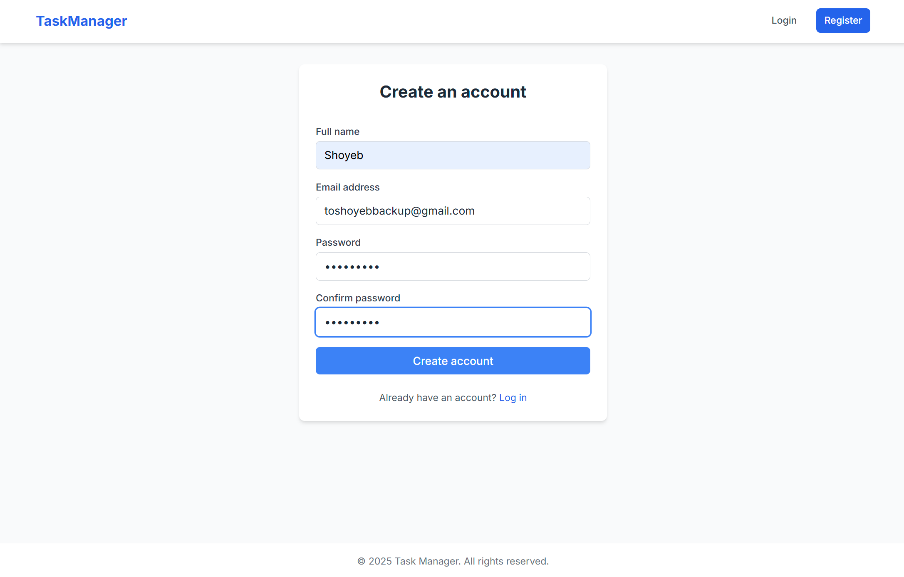
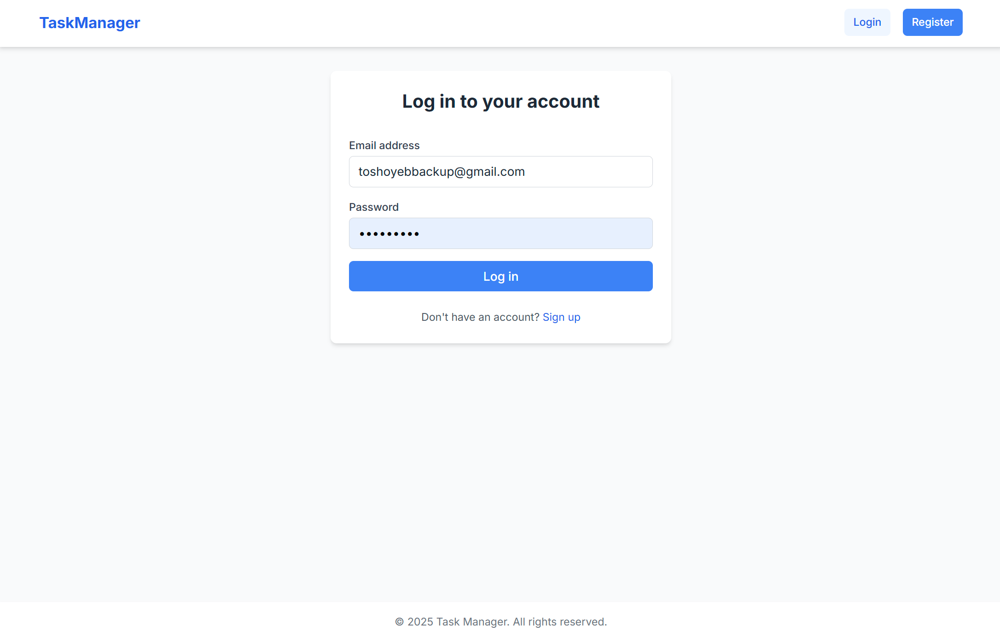
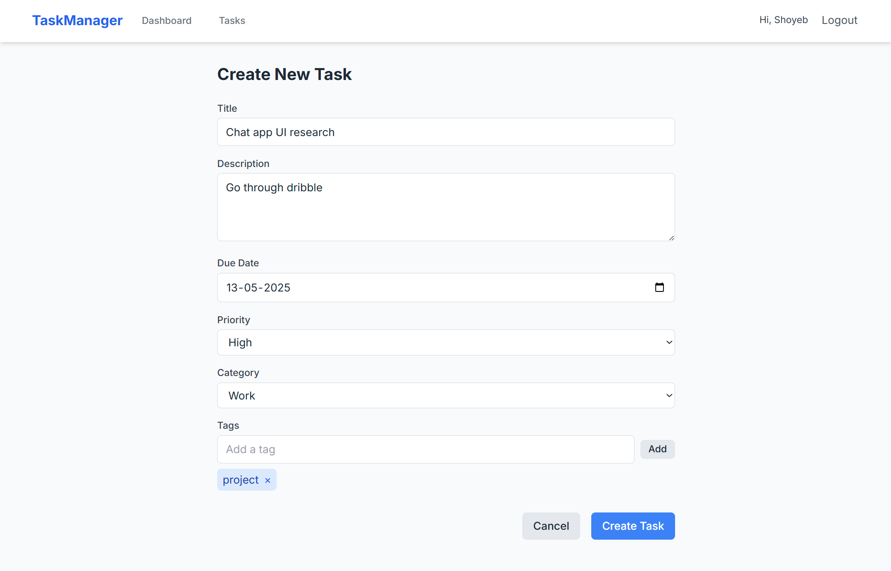
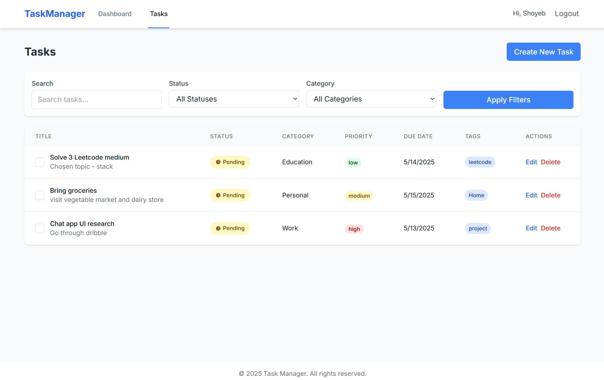
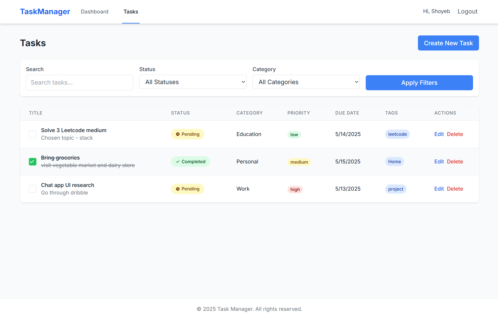
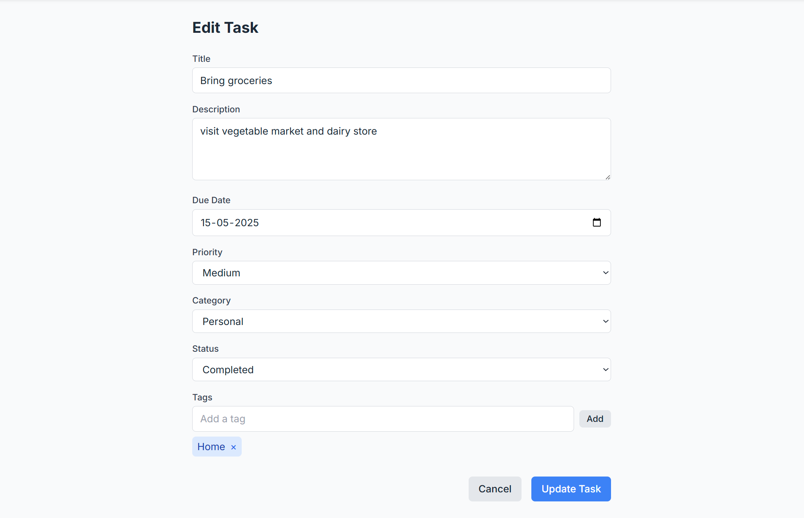
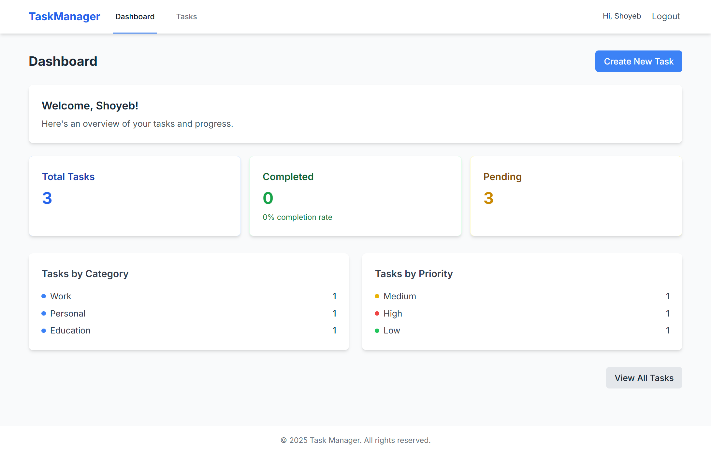

# Task Manager Frontend

A full-stack task management application that allows users to register, login, create tasks, update them, and visualize stats through a dashboard. Built with Vite, React, TypeScript, and Tailwind CSS.

## Deployment

### Deployed on Render

This frontend application is deployed and accessible at:
- **Live App URL**: `https://task-manager-fe-rv0m.onrender.com`
- **Platform**: [Render](https://render.com)
- **Deployment Type**: Static Site
- **Build Command**: `npm run build`
- **Publish Directory**: `dist`

## Features

- **User Authentication**: Sign up and log in
- **Task Management**: Create, read, update, and delete tasks
- **Task Organization**: Categorize tasks and add tags
- **Task Status**: Mark tasks as completed or pending
- **Task Filters**: Filter by category, status, and search by title
- **Dashboard**: View statistics about your tasks
- **Responsive Design**: Works on mobile and desktop

## Tech Stack

- **Framework**: React with TypeScript
- **Build Tool**: Vite
- **Styling**: Tailwind CSS
- **Routing**: React Router
- **HTTP Client**: Axios
- **Deployment**: Render

## Getting Started

1. **Clone the repository**:
   ```bash
   git clone <repository-url>
   cd task-manager-fe
   ```

2. **Install dependencies**:
   ```bash
   npm install
   ```

3. **Start the development server**:
   ```bash
   npm run dev
   ```

4. **Build for production**:
   ```bash
   npm run build
   ```

## Backend API

This frontend connects to a Node.js/Express backend at `https://task-manager-backend-8he0.onrender.com/api`.

If your backend is running on a different URL, update the `API_URL` in `src/services/api.ts`.

## Project Structure

```
task-manager-fe/
├── src/
│   ├── components/        # Reusable UI components
│   │   ├── common/        # General-purpose components
│   │   └── layout/        # Layout components
│   ├── context/           # React context providers
│   ├── pages/             # Page components
│   ├── services/          # API services
│   ├── types/             # TypeScript type definitions
│   ├── App.tsx            # Main application component
│   └── main.tsx           # Entry point
├── public/                # Static assets
├── dist/                  # Build output (generated after build)
├── index.html             # HTML template
└── tailwind.config.js     # Tailwind CSS configuration
```

## 📸 Screenshots

### 🔐 Register Page
User can sign up by providing basic details to create a new account.



---

### 🔑 Login Page
User can securely log in using registered credentials.



---

### ➕ Create New Task
User can add a new task by specifying title, description, category, and due date.



---

### 📋 Task List Page
Displays a list of all created tasks with filtering options and the ability to edit or delete.



---

### ✅ Mark Task Complete
User can mark tasks as complete directly from the task list.



---

### ✏️ Update Task
Edit any task’s details including title, category, status, and due date.



---

### 📊 Dashboard
Visual representation of completed vs pending tasks and other key stats.



## License

ISC
